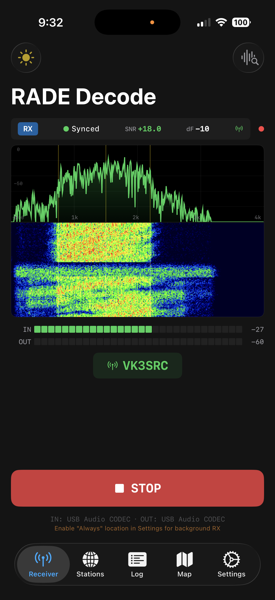

# RADE Decode — FreeDV RADE client for iOS

**Digital voice for HF radio, powered by a neural codec — receive with any radio, transmit wirelessly with an Icom IC-705.**

[English](#english) | [日本語](#日本語) | [繁體中文](#繁體中文) | [简体中文](#简体中文)

**TestFlight:** https://testflight.apple.com/join/3yT3Q7h9

Code: https://github.com/pepefrog1234/RADE_decode · Android port: https://github.com/pepefrog1234/RADE_decode_Android · Peter's fork: https://github.com/peterbmarks/RADE_decode

---

## English

### Overview

RADE Decode is an iOS transceiver app for **FreeDV RADE** (Radio Autoencoder), the machine-learning digital voice mode for HF SSB radio. The RADE V1 neural codec runs entirely on the iPhone — a pure C port with built-in model weights, no Python and no network required for decoding.

There are two ways to use it:

- **Audio-in receiver** — decode RADE from any SSB radio through the iPhone microphone or a USB audio interface.
- **Full wireless transceiver** — pair with an **Icom IC-705 over Wi-Fi** (RS-BA1 compatible LAN protocol) for receive, transmit, and rig control with no cables at all.

### Features

**Receive**
- RADE V1 neural decode with sync, SNR, and frequency-offset indicators
- Real-time spectrum and waterfall display, input/output level meters
- Decoded callsign display from the end-of-over frame
- Adaptive low-load mode for older devices

**Transmit (IC-705 Wi-Fi)**
- Microphone → RADE encoder → 48 kHz LAN audio to the radio, with your callsign sent in the end-of-over frame
- Automatic sideband selection: **LSB-D below 10 MHz, USB-D above**, applied on connect, on PTT, and when the dial crosses 10 MHz
- The radio's DATA MOD input is switched to WLAN automatically — no menu diving
- While transmitting, the waterfall becomes a live panel of FreeDV Reporter stations on your frequency showing who hears you and at what SNR

**IC-705 Wi-Fi integration**
- Control, CI-V, and audio UDP streams with login, packet retransmission, and jitter buffering (48 kHz LPCM both directions)
- Frequency, mode, and PTT control; dial frequency mirrored live in the app
- Connection watchdogs with automatic session recovery: a stalled audio stream is nudged back to life, a dead link reconnects by itself — even mid-over

**FreeDV Reporter**
- Reports received callsigns with SNR to qso.freedv.org, announces your transmit state, and keeps your reported frequency synced to the radio dial
- Online station list and map view

**Logging**
- Reception sessions logged with GPS position and WAV recordings (accessible from the Files app / Finder)
- Background capture: audio is recorded while the app is in the background and decoded when you return

### Requirements

- iPhone running iOS 18 or later
- For wireless operation: Icom IC-705 (Wi-Fi enabled, access-point mode or shared LAN)
- For audio-in decoding: any SSB receiver plus the iPhone mic or a USB audio interface

### Getting started (IC-705)

1. On the radio: SET → WLAN → enable Wi-Fi (access-point mode is simplest) and create a network user (ID/password).
2. Join the radio's Wi-Fi network with the iPhone.
3. In the app: Settings → **Audio Source: IC-705 WiFi**, enter the radio's IP, username, and password → Connect.
4. Press **START** to receive; press and hold **PTT** to talk. Sideband and DATA MOD are configured automatically.

### Operating notes

- Set the radio's **WLAN MOD Level** so RF power is normal with the **ALC meter barely moving** — same discipline as any FreeDV/digital mode.
- FreeDV RADE occupies about 750–2200 Hz of audio bandwidth; keep the TX filter wide (e.g. 100–2900 Hz).
- iOS limitation: when the transceiver input is USB audio, the built-in speaker cannot be used at the same time — USB input and built-in speaker are mutually exclusive routes.

### Acknowledgements

- David Rowe VK5DGR and the FreeDV team — [RADE](https://github.com/drowe67/radae) and [FreeDV](https://freedv.org)
- Xiph.Org / Opus — LPCNet feature extraction and FARGAN vocoder
- Protocol references: [wfview](https://wfview.org), [kappanhang](https://github.com/nonoo/kappanhang), NetworkIcom
- Peter Marks VK3TPM for UI and audio-device contributions

License: LGPL 2.1 (see [LICENSE](LICENSE)).

---

## 日本語

### 概要

RADE Decode は、HF SSB 無線用の機械学習デジタル音声モード **FreeDV RADE**（Radio Autoencoder）の iOS トランシーバーアプリです。RADE V1 ニューラルコーデックは iPhone 上で完結して動作します（モデル重み内蔵の純 C 移植版、Python 不要、デコードにネットワーク接続も不要）。

使い方は 2 通りあります。

- **オーディオ入力での受信** — iPhone のマイクまたは USB オーディオインターフェース経由で、任意の SSB 無線機から RADE をデコード。
- **フルワイヤレス・トランシーバー** — **Icom IC-705 と Wi-Fi 接続**（RS-BA1 互換 LAN プロトコル）し、ケーブルなしで受信・送信・リグコントロール。

### 機能

**受信**
- RADE V1 ニューラルデコード（同期・SNR・周波数オフセット表示）
- リアルタイムスペクトラム＆ウォーターフォール、入出力レベルメーター
- エンドオブオーバーフレームからのコールサイン表示
- 旧機種向けの負荷適応モード

**送信（IC-705 Wi-Fi）**
- マイク → RADE エンコーダー → 48 kHz LAN オーディオで無線機へ。コールサインはエンドオブオーバーで送出
- サイドバンド自動選択：**10 MHz 未満は LSB-D、以上は USB-D**（接続時・PTT 時・ダイヤルが 10 MHz を跨いだ時に適用）
- 無線機の DATA MOD 入力を自動で WLAN に切替 — メニュー操作不要
- 送信中はウォーターフォールが「自分の周波数を受信している FreeDV Reporter 局」のライブパネルに切り替わり、誰にどの SNR で届いているかを表示

**IC-705 Wi-Fi 連携**
- 制御・CI-V・オーディオの 3 本の UDP ストリーム（ログイン、パケット再送、ジッタバッファ、双方向 48 kHz LPCM）
- 周波数・モード・PTT 制御、ダイヤル周波数のリアルタイム表示
- 接続ウォッチドッグと自動復旧：停止したオーディオストリームの再起動、切断時の自動再接続（送信中でも復帰）

**FreeDV Reporter**
- 受信したコールサインと SNR を qso.freedv.org へ報告、送信状態の通知、報告周波数はダイヤルに自動追従
- オンライン局リストとマップ表示

**ログ**
- 受信セッションを GPS 位置と WAV 録音付きで記録（「ファイル」アプリ / Finder からアクセス可能）
- バックグラウンドキャプチャ：バックグラウンド中の音声を記録し、フォアグラウンド復帰時にデコード

### 動作環境

- iOS 18 以降の iPhone
- ワイヤレス運用：Wi-Fi 対応の Icom IC-705（アクセスポイントモードまたは同一 LAN）
- オーディオ入力デコード：任意の SSB 受信機 + iPhone マイクまたは USB オーディオインターフェース

### はじめかた（IC-705）

1. 無線機側：SET → WLAN → Wi-Fi を有効化（アクセスポイントモードが簡単）し、ネットワークユーザー（ID / パスワード）を作成。
2. iPhone を無線機の Wi-Fi ネットワークに接続。
3. アプリ側：設定 → **Audio Source: IC-705 WiFi** を選び、無線機の IP・ユーザー名・パスワードを入力 → Connect。
4. **START** で受信開始、**PTT** 長押しで送信。サイドバンドと DATA MOD は自動設定されます。

### 運用メモ

- 無線機の **WLAN MOD Level** は「RF 出力が正常で **ALC メーターがほぼ振れない**」ところに調整してください（デジタルモード共通の作法です）。
- FreeDV RADE のオーディオ帯域は約 750–2200 Hz です。送信フィルターは広め（例：100–2900 Hz）にしてください。
- iOS の制限：トランシーバー入力が USB オーディオの場合、内蔵スピーカーとの同時使用はできません。

### 謝辞

- David Rowe VK5DGR と FreeDV チーム — [RADE](https://github.com/drowe67/radae) / [FreeDV](https://freedv.org)
- Xiph.Org / Opus — LPCNet 特徴抽出と FARGAN ボコーダー
- プロトコル参考実装：[wfview](https://wfview.org)、[kappanhang](https://github.com/nonoo/kappanhang)、NetworkIcom
- UI とオーディオデバイス周りの貢献：Peter Marks VK3TPM

ライセンス：LGPL 2.1（[LICENSE](LICENSE) を参照）。

---

## 繁體中文

### 簡介

RADE Decode 是 **FreeDV RADE**（Radio Autoencoder，無線電自編碼器）的 iOS 收發信 App — 這是以機器學習驅動的 HF SSB 數位語音模式。RADE V1 類神經編解碼器完全在 iPhone 上執行（內建模型權重的純 C 移植版本，不需要 Python，解碼也不需要網路連線）。

兩種使用方式：

- **音訊輸入接收** — 透過 iPhone 麥克風或 USB 音訊介面，解碼任何 SSB 無線電收到的 RADE 訊號。
- **全無線收發信機** — 與 **Icom IC-705 透過 Wi-Fi 配對**（相容 RS-BA1 的區域網路通訊協定），不需任何線材即可接收、發射與控制無線電。

### 功能

**接收**
- RADE V1 類神經解碼，含同步、SNR 與頻率偏移指示
- 即時頻譜與瀑布圖顯示、輸入/輸出電平表
- 從通聯結束（end-of-over）幀解出對方呼號並顯示
- 針對較舊裝置的自動低負載模式

**發射（IC-705 Wi-Fi）**
- 麥克風 → RADE 編碼器 → 48 kHz 網路音訊送往無線電，呼號隨通聯結束幀送出
- 自動選擇邊帶：**10 MHz 以下用 LSB-D、以上用 USB-D**，於連線、按下 PTT、旋鈕跨越 10 MHz 時自動套用
- 自動把無線電的 DATA MOD 輸入切換為 WLAN — 不必進選單設定
- 發射期間瀑布圖會切換成即時面板，顯示 FreeDV Reporter 上同頻率有哪些電台聽到你、SNR 多少

**IC-705 Wi-Fi 整合**
- 控制、CI-V、音訊三條 UDP 串流，含登入、封包重傳與抖動緩衝（雙向 48 kHz LPCM）
- 頻率、模式與 PTT 控制；旋鈕頻率即時鏡射到 App
- 連線看門狗與自動復原：音訊串流卡住會自動喚醒、連線中斷會自動重新連線 — 即使發生在發射途中

**FreeDV Reporter**
- 將收到的呼號與 SNR 回報至 qso.freedv.org、通告發射狀態，回報頻率自動跟隨無線電旋鈕
- 線上電台列表與地圖檢視

**紀錄**
- 接收工作階段連同 GPS 位置與 WAV 錄音一併記錄（可從「檔案」App / Finder 存取）
- 背景擷取：App 在背景時持續錄下音訊，回到前景後再解碼

### 系統需求

- iOS 18 或更新版本的 iPhone
- 無線操作：支援 Wi-Fi 的 Icom IC-705（存取點模式或同一區域網路）
- 音訊輸入解碼：任何 SSB 接收機，搭配 iPhone 麥克風或 USB 音訊介面

### 快速上手（IC-705）

1. 無線電端：SET → WLAN → 啟用 Wi-Fi（存取點模式最簡單），並建立網路使用者（帳號/密碼）。
2. 讓 iPhone 加入無線電的 Wi-Fi 網路。
3. App 端：設定 → **Audio Source: IC-705 WiFi**，輸入無線電 IP、使用者名稱與密碼 → Connect。
4. 按 **START** 開始接收；按住 **PTT** 說話。邊帶與 DATA MOD 都會自動設定。

### 操作注意事項

- 請調整無線電的 **WLAN MOD Level**，讓 RF 功率正常且 **ALC 表幾乎不動** — 與所有 FreeDV/數位模式相同的原則。
- FreeDV RADE 佔用約 750–2200 Hz 音訊頻寬；發射濾波器請保持寬設定（例如 100–2900 Hz）。
- iOS 限制：收發信機輸入使用 USB 音訊時，無法同時使用內建揚聲器 — USB 輸入與內建揚聲器是互斥的音訊路徑。

### 致謝

- David Rowe VK5DGR 與 FreeDV 團隊 — [RADE](https://github.com/drowe67/radae) / [FreeDV](https://freedv.org)
- Xiph.Org / Opus — LPCNet 特徵擷取與 FARGAN 語音合成器
- 通訊協定參考實作：[wfview](https://wfview.org)、[kappanhang](https://github.com/nonoo/kappanhang)、NetworkIcom
- UI 與音訊裝置相關貢獻：Peter Marks VK3TPM

授權條款：LGPL 2.1（詳見 [LICENSE](LICENSE)）。

---

## 简体中文

### 简介

RADE Decode 是 **FreeDV RADE**（Radio Autoencoder，无线电自编码器）的 iOS 收发信 App — 一种由机器学习驱动的 HF SSB 数字语音模式。RADE V1 神经编解码器完全在 iPhone 本地运行（内置模型权重的纯 C 移植版本，无需 Python，解码也无需联网）。

两种使用方式：

- **音频输入接收** — 通过 iPhone 麦克风或 USB 音频接口，解码任何 SSB 电台收到的 RADE 信号。
- **全无线收发信机** — 与 **Icom IC-705 通过 Wi-Fi 配对**（兼容 RS-BA1 的局域网协议），无需任何线缆即可接收、发射与控制电台。

### 功能

**接收**
- RADE V1 神经解码，含同步、信噪比与频率偏移指示
- 实时频谱与瀑布图显示、输入/输出电平表
- 从通联结束（end-of-over）帧解出对方呼号并显示
- 针对较旧设备的自动低负载模式

**发射（IC-705 Wi-Fi）**
- 麦克风 → RADE 编码器 → 48 kHz 网络音频送往电台，呼号随通联结束帧发出
- 自动选择边带：**10 MHz 以下用 LSB-D、以上用 USB-D**，在连接、按下 PTT、旋钮跨越 10 MHz 时自动应用
- 自动把电台的 DATA MOD 输入切换为 WLAN — 无需进菜单设置
- 发射期间瀑布图切换为实时面板，显示 FreeDV Reporter 上同频率有哪些电台听到你、信噪比多少

**IC-705 Wi-Fi 集成**
- 控制、CI-V、音频三条 UDP 流，含登录、丢包重传与抖动缓冲（双向 48 kHz LPCM）
- 频率、模式与 PTT 控制；旋钮频率实时镜像到 App
- 连接看门狗与自动恢复：音频流卡住会自动唤醒、连接断开会自动重连 — 即使发生在发射途中

**FreeDV Reporter**
- 将收到的呼号与信噪比上报至 qso.freedv.org、通告发射状态，上报频率自动跟随电台旋钮
- 在线电台列表与地图视图

**日志**
- 接收会话连同 GPS 位置与 WAV 录音一并记录（可从「文件」App / Finder 访问）
- 后台采集：App 在后台时持续录制音频，回到前台后再解码

### 系统要求

- iOS 18 或更新版本的 iPhone
- 无线操作：支持 Wi-Fi 的 Icom IC-705（接入点模式或同一局域网）
- 音频输入解码：任何 SSB 接收机，搭配 iPhone 麦克风或 USB 音频接口

### 快速上手（IC-705）

1. 电台端：SET → WLAN → 启用 Wi-Fi（接入点模式最简单），并创建网络用户（账号/密码）。
2. 让 iPhone 加入电台的 Wi-Fi 网络。
3. App 端：设置 → **Audio Source: IC-705 WiFi**，输入电台 IP、用户名与密码 → Connect。
4. 按 **START** 开始接收；按住 **PTT** 说话。边带与 DATA MOD 均自动配置。

### 操作注意事项

- 请调整电台的 **WLAN MOD Level**，使 RF 功率正常且 **ALC 表几乎不动** — 与所有 FreeDV/数字模式相同的原则。
- FreeDV RADE 占用约 750–2200 Hz 音频带宽；发射滤波器请保持宽设置（例如 100–2900 Hz）。
- iOS 限制：收发信机输入使用 USB 音频时，无法同时使用内置扬声器 — USB 输入与内置扬声器是互斥的音频路径。

### 致谢

- David Rowe VK5DGR 与 FreeDV 团队 — [RADE](https://github.com/drowe67/radae) / [FreeDV](https://freedv.org)
- Xiph.Org / Opus — LPCNet 特征提取与 FARGAN 声码器
- 协议参考实现：[wfview](https://wfview.org)、[kappanhang](https://github.com/nonoo/kappanhang)、NetworkIcom
- UI 与音频设备相关贡献：Peter Marks VK3TPM

许可证：LGPL 2.1（见 [LICENSE](LICENSE)）。
